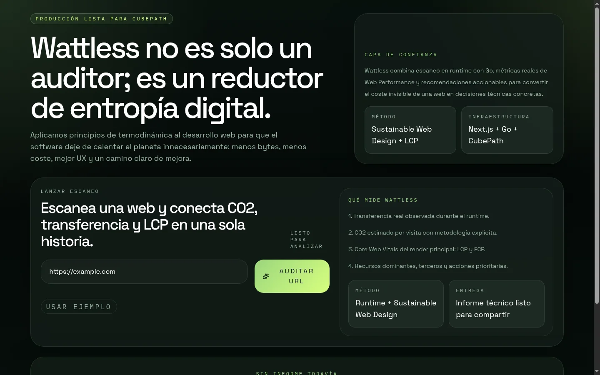

# Wattless

> Wattless no es solo un auditor; es un reductor de entropía digital. Aplicamos los principios de la termodinámica al desarrollo web para que el software deje de calentar el planeta innecesariamente.

Wattless es una auditoría web de sostenibilidad y rendimiento construida para la Hackatón CubePath 2026. Escanea una URL real, mide transferencia, `CO2` por visita, `LCP`, `FCP`, dependencia de terceros y hosting verde, y devuelve un informe técnico con recomendaciones accionables y un `Green Fix` orientado a código real.

## Qué problema resuelve

La web tiene un coste invisible. Cada recurso pesado, cada script bloqueante y cada tercero innecesario aumentan la transferencia, empeoran la experiencia y convierten energía útil en calor residual en servidores y dispositivos.

Wattless convierte ese coste invisible en un informe claro:

- bytes transferidos en runtime
- `CO2` estimado por visita
- `LCP`, `FCP`, `load` y tiempo de scripts
- recursos dominantes y ahorro potencial
- resumen IA y refactor guiado para un snippet real

## Estado de despliegue

- URL pública en CubePath: `pendiente de desplegar`
- Estado actual: stack de producción validado localmente con `docker/compose.prod.yml`
- Repo público: `https://github.com/tronchos/wattless`

## Capturas y material visual

- Captura actual del dashboard: [`docs/media/wattless-dashboard.webp`](docs/media/wattless-dashboard.webp)
- Reporte JSON usado para esa captura: [`docs/media/wattless-dashboard-report.json`](docs/media/wattless-dashboard-report.json)
- Material visual disponible: `docs/media/`
- Guion del pitch: [`docs/pitch.md`](docs/pitch.md)



## Cómo funciona

1. El frontend de Next.js envía la URL al BFF same-origin.
2. El backend en Go lanza Chromium con `rod` y captura tráfico de red, rendimiento y screenshot.
3. Wattless calcula `CO2` por visita usando la fórmula base de Sustainable Web Design.
4. Se consulta Greencheck para validar si el hosting es verde.
5. Se priorizan los recursos más costosos y se generan insights IA con fallback heurístico.
6. El usuario puede pegar un snippet real y obtener un `Green Fix` listo para revisar.

## Arquitectura del monorepo

- `client/`: Next.js App Router, dashboard, BFF y exportación de Markdown.
- `server/`: API Go, scanner con `rod`, cálculo de CO2, hosting check e insights.
- `docker/`: desarrollo local y despliegue de producción para CubePath.

## Metodología del cálculo

Wattless usa la aproximación base de Sustainable Web Design para traducir transferencia en impacto por visita:

```text
(bytes / 1_000_000_000) * 0.8 * 0.75 * 442
```

Supuestos explícitos del MVP:

- `0.8 kWh / GB` de transferencia
- `0.75` como factor de retorno/visitas repetidas
- `442 gCO2e / kWh` como promedio global

Además del CO2, el informe incorpora `LCP`, `FCP` y tiempo de scripts para conectar sostenibilidad con experiencia de usuario.

## Cómo usamos CubePath

CubePath es el destino de despliegue de producción del proyecto:

- `client` se expone públicamente desde CubePath
- `server` queda en red interna privada
- el frontend consume el backend a través del BFF de Next
- la topología está pensada para ejecutarse con contenedores separados y healthchecks

Archivos relevantes:

- `docker/client.prod.Dockerfile`
- `docker/server.prod.Dockerfile`
- `docker/compose.prod.yml`

## Endpoints principales

### Backend Go

- `GET /healthz`
- `POST /api/v1/scans`
- `POST /api/v1/green-fix`

### Frontend Next.js

- `GET /api/healthz`
- `POST /api/scan`
- `POST /api/green-fix`

## Desarrollo local

### Requisitos

- Go `1.24+`
- Node.js `20+`
- Docker y Docker Compose para validar el stack de producción local

### Arranque rápido

```bash
make install
make server-dev
make client-dev
```

### Validación con Docker

```bash
docker compose -f docker/compose.prod.yml up --build
```

### Variables principales

#### Backend

- `PORT` default `8080`
- `CLIENT_ORIGIN` default `http://localhost:3000`
- `REQUEST_TIMEOUT` default `20s`
- `NAVIGATION_TIMEOUT` default `15s`
- `NETWORK_IDLE_WAIT` default `1500ms`
- `VIEWPORT_WIDTH` default `1440`
- `VIEWPORT_HEIGHT` default `900`
- `BROWSER_BIN` ruta opcional a Chromium/Chrome
- `GREENCHECK_BASE_URL` default `https://api.thegreenwebfoundation.org/api/v3/greencheck`
- `AI_PROVIDER` default `rule_based`
- `GEMINI_API_KEY` opcional
- `GEMINI_API_KEY_FILE` opcional, con prioridad sobre `GEMINI_API_KEY` cuando apunta a un archivo no vacío
- `GEMINI_MODEL` default `gemini-2.0-flash`
- `LLM_TIMEOUT` default `12s`

#### Frontend

- `SCANNER_API_URL` backend interno consumido por el BFF
- `NEXT_PUBLIC_APP_URL` opcional para incluir la URL pública de Wattless en el Markdown exportado

## Limitaciones reales

- El cálculo de `CO2` es una estimación basada en transferencia, no una medición eléctrica directa.
- El `Green Fix` trabaja sobre snippets pegados por la persona usuaria; no reconstruye automáticamente el código fuente de un sitio tercero.
- El veredicto de hosting depende de la disponibilidad de The Green Web Foundation.
- Algunos recursos no tienen anclaje visual y no pueden resaltarse sobre la captura.
- El escáner solo acepta destinos públicos `http/https`; bloquea `localhost`, IPs privadas y hosts internos.

## Roadmap corto post-hackatón

- despliegue público en CubePath con dominio final
- GIF corto del flujo completo una vez exista URL pública
- más contexto de third-party cost y budget por recurso
- exportación de reportes más orientada a PRs técnicos
